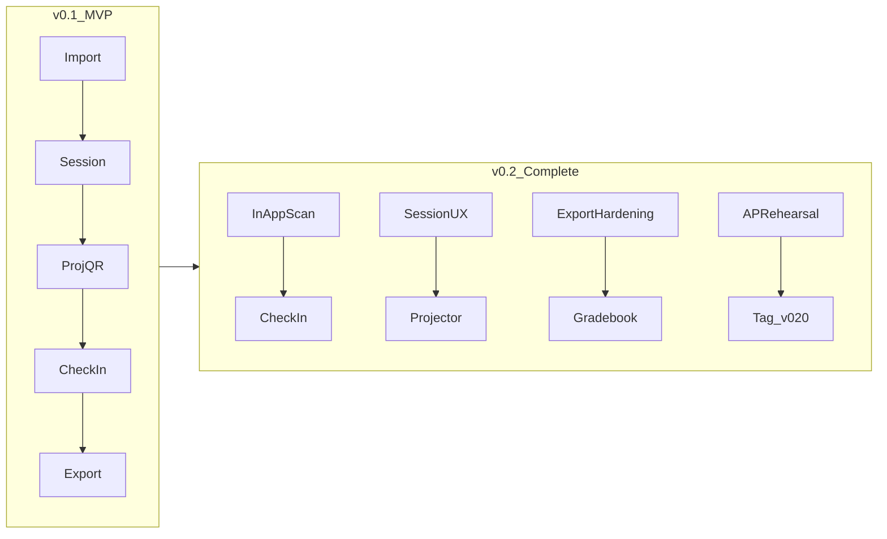

# Attendance Tracker v0.2 — Classroom-complete

Baseline: **`v0.1.0-mvp`** ships import → session → rotating projector QR → check-in → overrides → gradebook export → demo section INF191. Next phase closes the gaps that make day-to-day teaching feel unfinished.

## What “complete” means for v0.2

A teacher can run **real INF231/INF232 class meetings** on the AP laptop with:

- Students checking in without confusion (scan in-app or OS camera)
- Roster/export matching the perfect gradebook with fewer name mismatches
- Clear session controls (start for today’s schedule, cancel without inventing absences)
- One rehearsed classroom runbook that you trust

**Explicitly deferred to later (not v0.2):** school Google SSO, Vercel/Postgres multi-tenant, geofence, Teams hooks, face recognition.

## Milestones (push after each)

### P1 — In-app QR scan on student join

**Why:** Students ask “where’s the camera?”; OS camera works but in-app scan feels complete.

- Add Scan QR on [`app/join/page.tsx`](../../app/join/page.tsx) (client island): `getUserMedia` + `html5-qrcode`
- On success, navigate to same join URL shape: `?token=&sectionCode=` then existing server-action confirm path in [`app/join/actions.ts`](../../app/join/actions.ts)
- Keep typeable fallback code; HTTPS/permission failures show a clear caption and fall back to OS camera / typed code
- Note LAN HTTP camera limits in [`10-classroom-runbook.md`](../references/10-classroom-runbook.md)

### P2 — Session UX for real class days

**Why:** MVP start is enough for demos; class days need clearer meeting choice and a safe abort.

- Section page: highlight **today’s** schedule template(s) (Manila date + `dayOfWeek`)
- **Cancel / discard open session** without writing auto-`0`
- After end: one-click to roster + export
- Soft-label **INF191** as Demo in teacher UI so it never mixes with real sections

### P3 — Export and roster hardening

**Why:** Name-only matching and late adds are the main gradebook risk.

- Prefer matching export rows by **Student ID** when the workbook can carry/add an ID column; otherwise keep name match + improve normalization
- Late adds in app: append midterms row (with MIDTERM formula copy) or fail loudly with actionable `_export_notes`
- Re-export is idempotent for opened dates only; never invent `0` for unopened columns
- Smoke test: INF231 + INF232 export opens in Excel; `summary` still computes

### P4 — Projector and live-room polish

**Why:** Social accountability is the anti-cheat layer you chose.

- Projector: larger latest name, short recent list (last 5), optional TTS remains off by default
- Roster: keyboard-friendly code set; filter unmarked default during open session
- Student done page: clearer code meaning

### P5 — Classroom packaging

**Why:** One path for “open laptop, class starts in 2 minutes.”

- `docker compose up --build` verified as primary classroom path; seed-demo documented
- Refresh classroom runbook + README
- One-command smoke: `npm test` + `npm run smoke:http` after start

### P6 — Live AP rehearsal + tag

**Why:** Completeness is proven in the room, not only in Vitest.

- Dry-run INF231 **or** INF232 on teacher AP with 3–5 real phones
- File issues in `.cursor/references/17-v0.2-rehearsal-notes.md`
- Fix blockers from that run
- Tag **`v0.2.0`** on `main` (no AI co-author trailers)

## Out of scope for v0.2

- Student password accounts / school SSO
- Cloud deploy (Vercel) + Postgres
- Geofence, device fingerprinting, face ID
- Writing into `teaching/attendance/*.xlsx` outside the app’s template clone export
- Multi-teacher / multi-tenant SaaS
